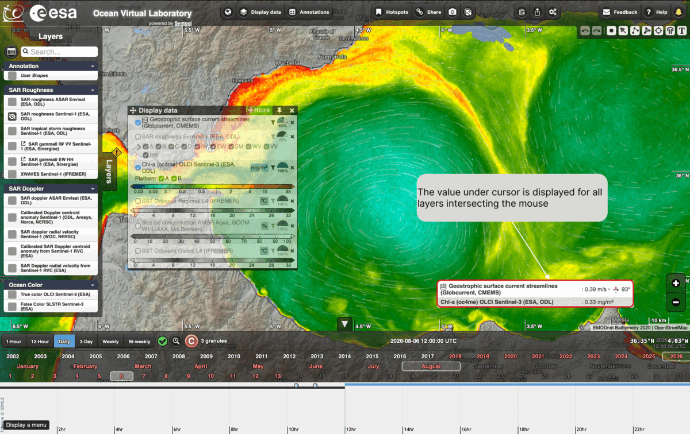
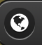
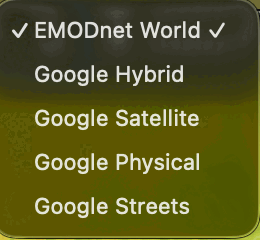
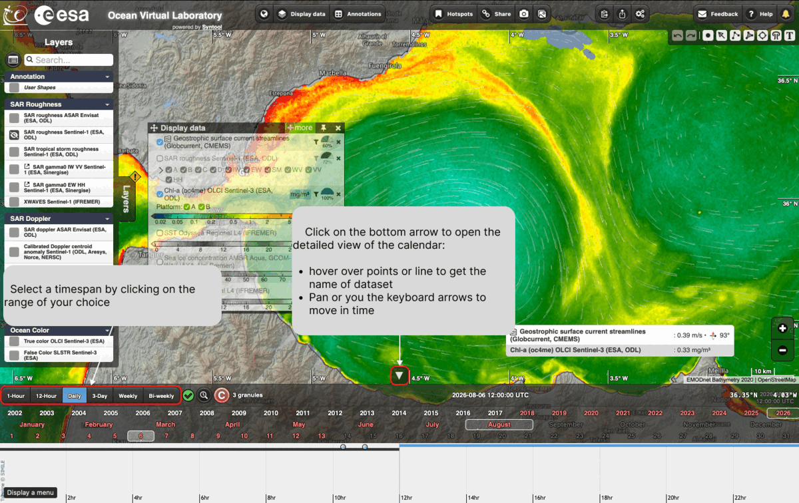
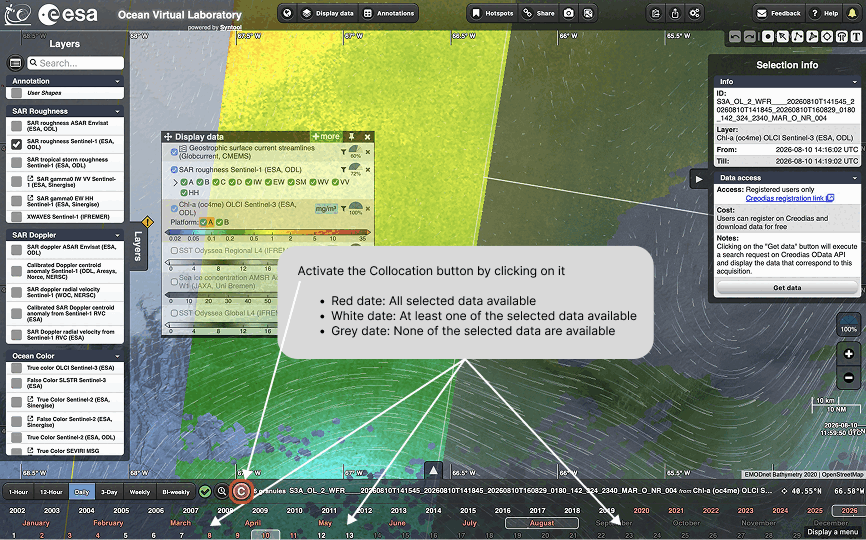
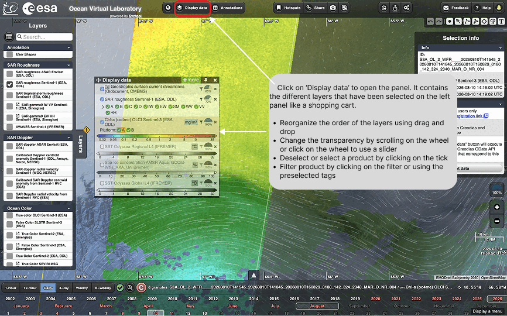
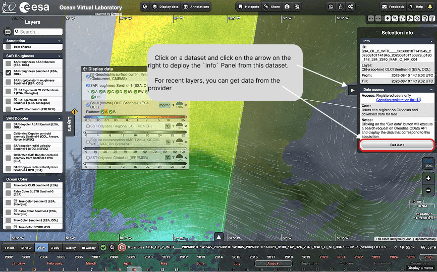
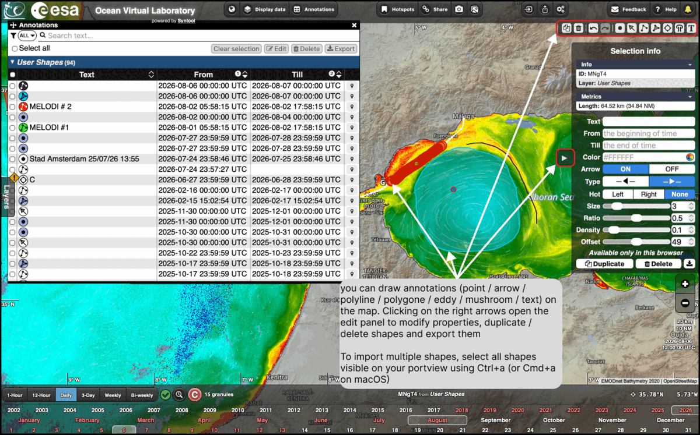
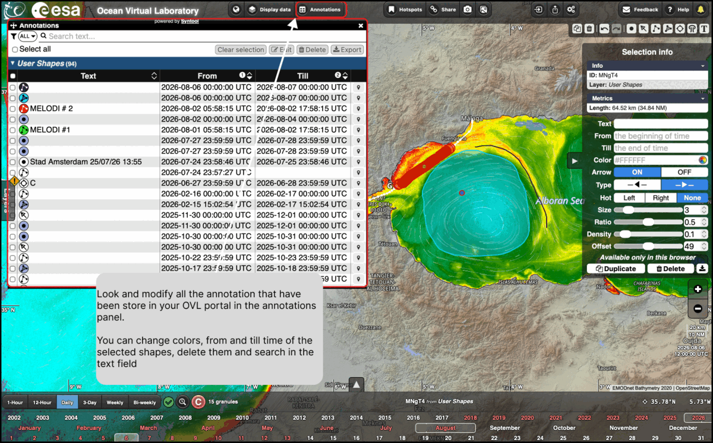
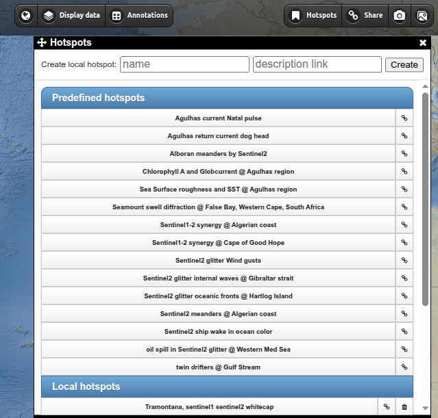

# Specific features

## The map

The map fills most of the window and is the main working area of the portal:
every layer you activate is drawn on it, on top of a base map.

### Moving around the map

* **Pan** — click on the map and drag it to move to another area.
* **Zoom** — scroll on the map, or use the **+** and **−** buttons on the right
  hand side. The scale bar at the bottom right updates as you zoom.

### Reading the values under the cursor

Move the mouse over the map: the value under the cursor is displayed for all the
layers intersecting it, in a box at the bottom right. Each line gives the name of
the layer and its value in the unit of that layer — in the example below the
geostrophic surface current, 0.39 m/s at 93°, and the chlorophyll-a
concentration, 0.33 mg/m³.

### Choosing the base map

The base map is the background drawn under your data. Click on the globe button
in the toolbar at the top of the window to change it:

The list of available base maps opens, with a tick next to the one currently in
use. Click on a name to switch to it:

**EMODnet World**, the default, shows the bathymetry, which is convenient when
looking at ocean data. The four Google base maps are useful for a different
context: **Satellite** and **Hybrid** for imagery — the latter with place names
and borders drawn on top — **Physical** for relief, and **Streets** for coastal
and land features.

## The timeline

Moving through time, selecting a time range, animation.

 
<a href="https://youtu.be/LSLuJCebDVk?si=wvDRaWhXfNjqNH2K">▶ Video: How to play with time and timespan</a>

### Selecting a timespan

The buttons at the left end of the timeline — **1-Hour**, **12-Hour**, **Daily**,
**3-Day**, **Weekly** and **Bi-weekly** — set the timespan over which data are
looked for. Click on the range of your choice. The bar then shows the date being
displayed and the number of granules found for it.

### The detailed timeline

The detailed timeline is a detailed view of the calendar showing 
the window used to search for data (timespan) and where the granules actually are in
time.

Click on the arrow at the bottom edge of the map to open it. The
detailed calendar opens under the timeline, with the hours of the selected day
along it and one line per dataset. In this view you can:

* hover over a point or a line to get the name of the dataset
* pan, or use the keyboard arrows, to move in time

### Collocation

Activate the collocation button — the circled **C** at the left end of the
timeline — to see when the products you selected are available in your time and geographical window. By default, this option is activated.
The dates on the timeline are then colour-coded:

* **red** — all the selected data are available
* **white** — at least one of the selected data is available
* **grey** — none of the selected data is available

## The Display data panel

Click on **Display data** in the top toolbar to open the panel. It contains the
layers you selected in the left-hand panel, like a shopping cart, and is where
you control how they are drawn:

* reorder the layers by drag and drop
* change the transparency by scrolling on the wheel, or click on the wheel to
  use a slider
* deselect or select a product by clicking on its tick
* filter products with the filter icon or with the preselected tags

 
<a href="https://youtu.be/JmmjXxXYvvE?si=V4ZX_JpFJNfNQfX2">▶ Video: How to search and select products</a>

 
<a href="https://youtu.be/OieBsyeamQo?si=IdfqwNTgYguG3CFD">▶ Video: How to compare data playing with layers</a>

### Getting the data from the provider

Click on a dataset, then on the arrow on its right, to deploy the **Info** panel
for that dataset. It gives the granule identifier, the time coverage of the
layer, and the conditions to access the data.

For recent layers you can retrieve the data from the provider: the **Get data**
button runs a search request against the Creodias OData API and displays the
products corresponding to your acquisition. Access is restricted to registered
users, but registration on Creodias is free.

## Rendering parameters

Colorbars / transparancy / 1

## Annotations

Annotations are the shapes you draw on the map yourself. They are stored in your
browser, and can be edited and exported at any time.

### Drawing a shape

Select “User shapes” in the list of products (in the Annotation group), the product will automatically be selected when choosing one of the drawing tools

A box with shapes is located on the top right, you can choose between point, arrow, polyline, polygon, eddy, mushroom or text

Select the desired shape and click on the map to draw. Hold the click button for continuous drawing

You can select a single shape by clicking on it or an ensemble of shapes using Ctrl+A (or Cmd+A on mac), you can edit your selection and export them using the right panel

Click on the arrow on the right of the map to open the edit panel of the
selection. It gives the metrics computed for the shape — the length of a
polyline, for instance — and lets you change its text, its colour, the period
over which it is displayed, and the way it is drawn: arrow on or off, type, size,
ratio, density and offset. The same panel duplicates, deletes and downloads the
selection.

### The annotations panel

Click on **Annotations** in the top toolbar to look at and modify all the
annotations stored in your OVL portal. The panel lists the user shapes with their
text and the period they cover.

From this panel you can search in the text field, tick the shapes you are
interested in or use **Select all**, and then **Edit** the selection — colours,
and the *From* and *Till* times — **Delete** it, or **Export** it.

### Importing and exporting shapes

Shapes are not locked into the portal. They can be written out to a file and read
back in, in the formats supported by OVL — KML, GeoJSON and JSON among them.

To export, use **Export** in the annotations panel for the shapes you selected,
or the download button of the edit panel for a single shape or all shape visible in the viewport. To import, use the
import button in the top bar of the window.

Look at the Youtube tutorial video for more features:

 
<a href="https://youtu.be/6YPwJCFHBIc?si=2GR42P3bvj18SaVb">▶ Video: How to draw a synoptic chart</a>

## Distance measurement, transects and layers extractions

How to measure a distance

 
<a href="https://youtu.be/Y9UGZOiF45w?si=b5Hddt-ghvCGx1-A">▶ Video: How to measure a distance</a>

Extracting values along a line (transect)

 
<a href="https://youtu.be/0KZaAIr20zI">▶ Video: How to extract values along a line</a>

Extracting layers over a bounding box

 
<a href="https://youtu.be/FpB6r0SYz4w?si=4tSx23vBHTWH-0rW">▶ Video: How to Extract layers over a bounding box</a>

## Lagrangian advection

How to advect particules with vector fields from OVL portal

 
<a href="https://youtu.be/hWdjWqkyBHM?si=dFefEGFH0rvVz7zn">▶ Video: How to advect particules with vector fields from OVL portal</a>

## Hotspots

Bookmarked case studies: what they are and how to use them.

## Sharing

Sharing the current view by URL, and creating shareable bookmarks with previews
through [SEAShot](../seashot/index.md).

## Preferences and personal data

Importing and exporting your settings and personal data.
