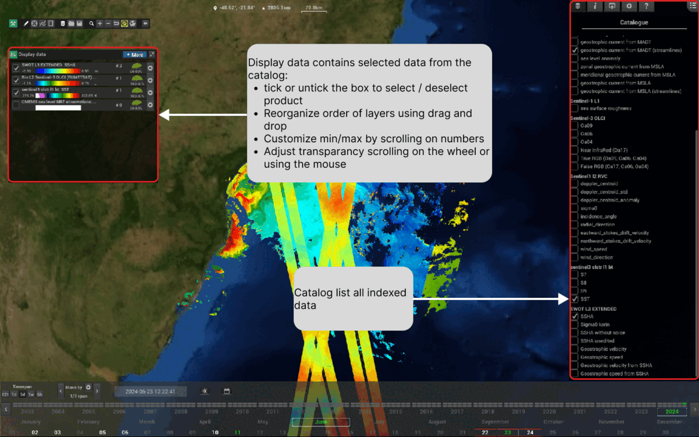
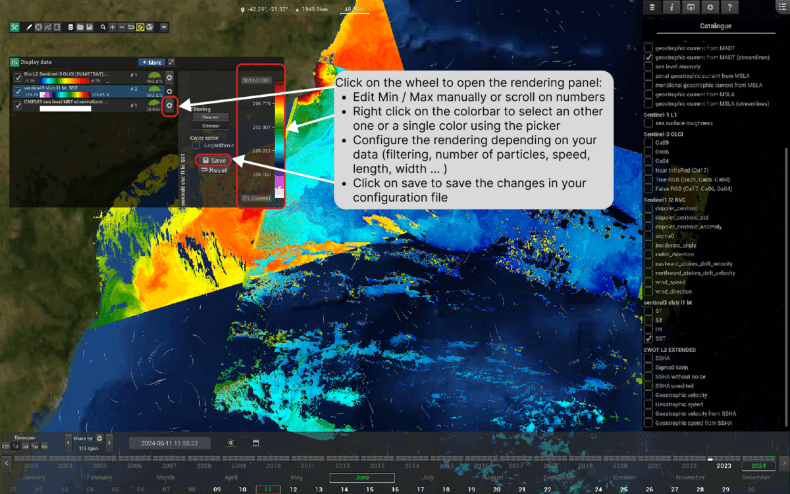
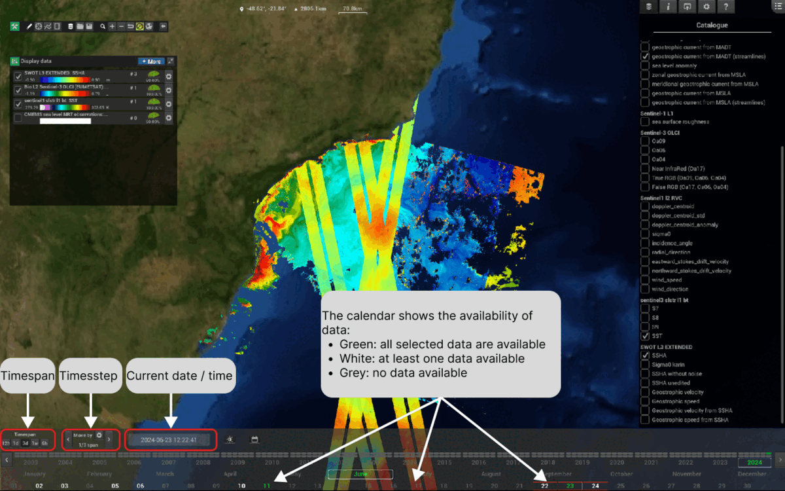

# Specific features of the viewer

## Navigating the globe

Camera controls, zoom, and the different viewing modes.

## Working with layers

Two panels work together.

The **Catalogue**, on the right, lists all the data indexed in your data
directory, grouped by collection. Tick a product there to add it to the view.

The **Display data** panel, on the left, contains the products you selected from
the catalogue, and is where you control how they are drawn:

* tick or untick the box to select or deselect a product
* reorganise the order of the layers by drag and drop
* customise the min and max values by scrolling on the numbers
* adjust the transparency by scrolling on the wheel, or using the mouse

## Rendering and colormaps

Click on the wheel of a layer, in the Display data panel, to open its rendering
panel. From there you can:

* edit the **Min** and **Max** manually, or scroll on the numbers
* right click on the colorbar to pick another one, or a single colour with the
  colour picker
* configure the rendering according to your data — the filtering applied, and for
  streamlines the number of particles, their speed, length and width
* click on **Save** to write the changes into your configuration file

## Time navigation

Three controls sit at the left end of the timeline:

* **Timespan** — the width of the time window data is looked for in
* **Timestep** — how far one step moves, as a fraction of the span
* **Current date / time** — the instant being displayed

The calendar itself shows the availability of the data you selected:

* **green** — all the selected data are available
* **white** — at least one of the selected data is available
* **grey** — no data available

## Analysis tools

Extraction under a polygone
