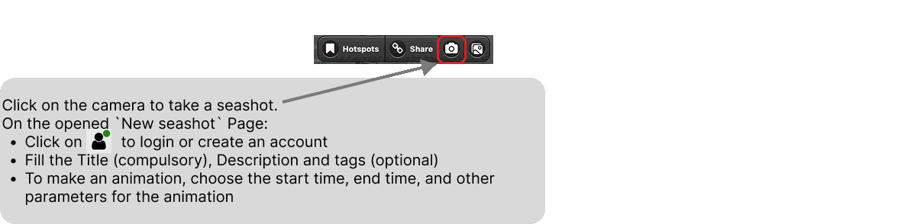
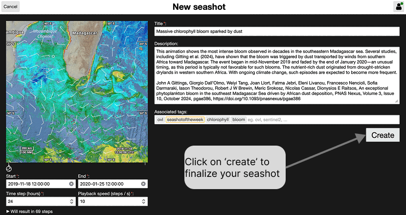

# Creating a seashot

A seashot is taken from the OVL portal, on the view you are currently looking at.
Click on the camera button in the toolbar at the top of the portal:

The **New seashot** page opens. It shows a preview of the captured view on the
left, and the information describing it on the right:

* click on the account button, at the top right, to log in or create an account —
  see [Sign up / Log in](login.md)
* fill in the **Title**, which is compulsory, and, if you want, a **Description**
  and a few **tags**
* to make an animation, set the **Start** and **End** dates, the **Time step** in
  hours and the **Playback speed** in steps per second; the page tells you how
  many steps the animation will contain

Click on **Create** to finalize your seashot.

