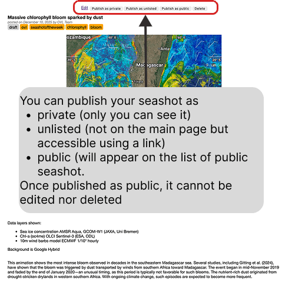
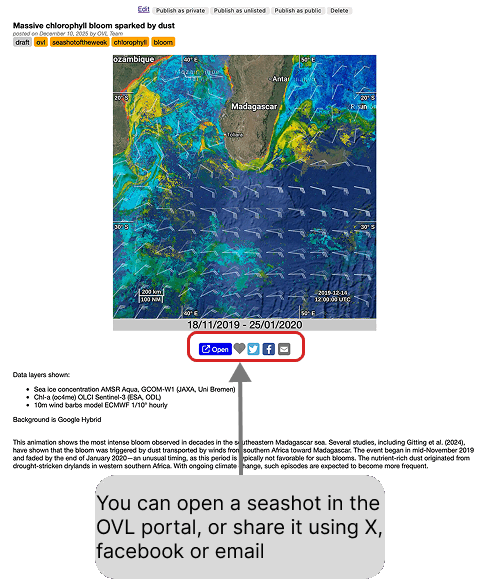

# Manage and share your seashots

## Publishing a seashot

A seashot you have just created is a draft. The bar at the top of its page lets
you edit it, delete it, or publish it at one of three levels:

* **private** — only you can see it
* **unlisted** — it does not appear on the main page, but anyone with the link
  can open it
* **public** — it appears in the list of public seashots

> [!WARNING]
> Once published as public, a seashot can no longer be edited nor deleted.
> Check it as private or unlisted first if you are not sure.

## Sharing a seashot

A published seashot shows the animation with the period it covers, the list of
the data layers displayed, the background used, and the description you wrote.

The buttons under the image let you open the seashot back in the OVL portal — so
that the reader lands on the very view you captured — or share it on X, on
Facebook, or by email.

